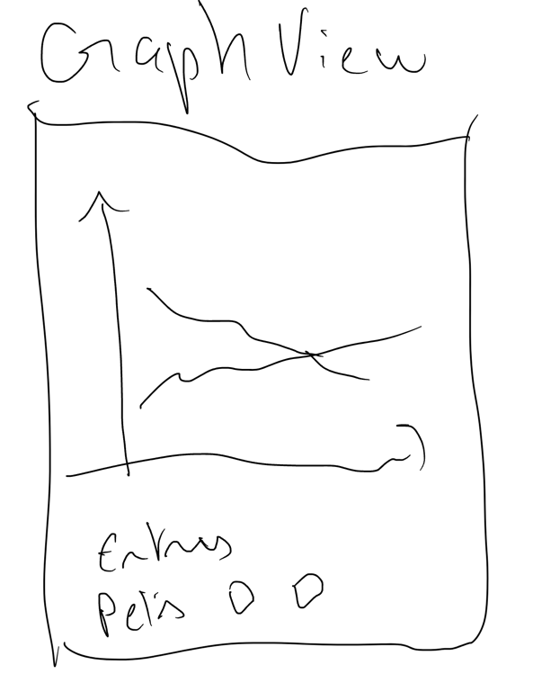

# My Pets Journal!


Flutter Application to create a Journal about you pet activities.

This project was created as part of [Supabase Launch Week 8 Hackathon](https://supabase.com/blog/supabase-lw8-hackathon)

## Getting Started

This project uses Flutter to make the iOS and Android applications. The back run totally on Supabase.

To run the project, simply runt he `main.dart` file using Flutter. Make sure you have a device available and run:
```bash
flutter run 
```


## Application structure

The application has 8 different screens as described byt this simple diagram:

[Diagram](https://www.nebo.app/page/5f32629f-29a0-407f-829d-0feb39ed55c4)

### Login Screen

Simple login screen connected to Supabase Auth. The Login screen allows to login with Google Account, Apple account, or simply by sending a "Magic Link" to an email address. 
You can find more information on [Supabase site](https://supabase.com/docs/guides/auth#overview)


### Home Page / Pet List

List of pets added to the user's family. They are shown as cards with their avatar and main info.
There is the possibility to add new pets to the family.


### Pet View

Allow to create, view and Edit pet information. 
It contains the avatar, the pet type, and breed

That's in this view that you can add a new entry for this pet.


### Add Entry View

A Journal entry is any action, activity, observation, measurement that a user wants to record.
It can for instance be going for a 40min walk, having 100g of food of a specific brand, or a weight measurement.

Entries can be recurring entries, such as vaccines or wormer, and you can specify if you want a reminder


### Entry Builder

Entries can be very flexible, and users can create their own which will have the possibility to be repeatable or have a value associated.


### Journal Screen

A list of all the entries for all pets in the family in reversed chronological order.
The entries can be filtered by entry type and by pet.


### Graph Screen

Rather than seeing the entries as a timeline, entries that have an associated value, such as weight, can be view in a graph.
You can show multiple pets at the same time on the graph.




### Profile Screen

To Manage your user information (avatar, name) and to add or remove users to your family.
Family members share all the same pets as pets are associated ot a family and not a specific user.


## Database Structure

The Database is defined in Supabase


## Learn more

A few resources to get you started if this is your first Flutter project:

- [Lab: Write your first Flutter app](https://docs.flutter.dev/get-started/codelab)
- [Cookbook: Useful Flutter samples](https://docs.flutter.dev/cookbook)

For help getting started with Flutter development, view the
[online documentation](https://docs.flutter.dev/), which offers tutorials,
samples, guidance on mobile development, and a full API reference.
